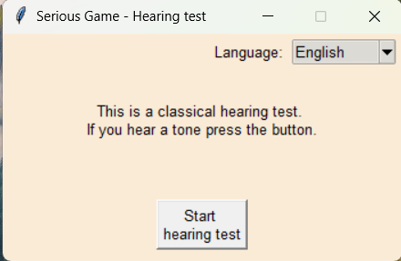
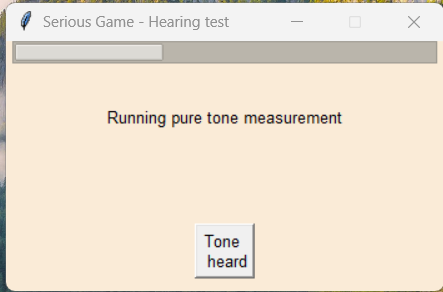
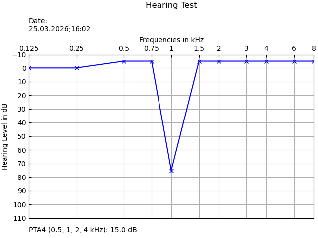
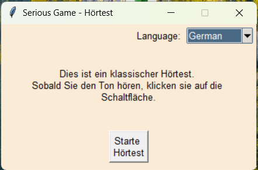
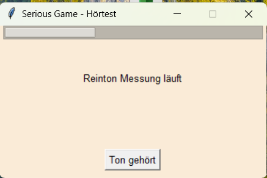
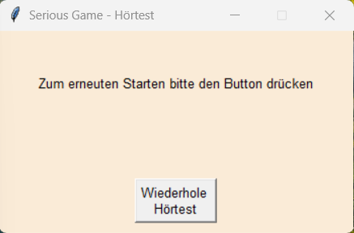
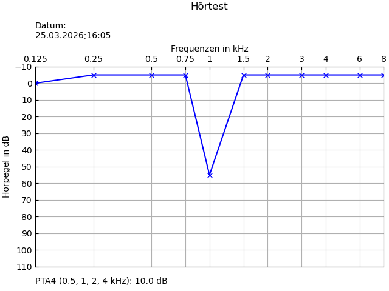

README - English
# Serious Game with Playful Elements : Audiology Hearing Test

This program demonstrates a standard hearing test. Based on the results of the hearing test, it can be used to assess whether a patient has hearing loss.

## Motivation
Hearing loss is a common problem that affects millions of people. The diagnosis of this condition is done by doctors and audiologists. Hearing loss often progresses gradually, especially in older adults. Additionally, many people avoid visiting a doctor due to psychological barriers. As a result, hearing loss is often diagnosed only when it is already at an advanced stage. As part of my training to become a data scientist, I am learning different skills such as Python, machine learning and SQL. Furthermore, I have gained basic knowledge in audiology through my previous work experience. Based on this, I aim to develop a simple at-home hearing test for patients. This test includes a basic hearing threshold measurement using standard pure tones. In addition, the test should analyze the speech understanding using the Freiburger one- and two-syllable test. Finally, the program should run via a web interface, allowing users to access the tool without installing additional software. The target audience includes anyone who wants to independently check their hearing in a simple and accessible way.

## Implemented functions
- The main.py file has been implemented to control the program.
- The program performs an audiological hearing test across standard frequencies (125-8000 Hz) with increasing sound levels.
- A GUI for the hearing test
- Display hearing outcome in an audiogram

## Screenshots

### Hearing Test GUI
 |  | 

### Example Audiogram

## Next steps
- Generate synthetic dataset for training a machine learning algorithm
- Develop, train and test of machine learning classifier

## Planned functions
- Integrate a speech test, for example, the Freiburger one- and two-syllable test.
- Build a level system for the game. The game mechanics are currently in the conceptual phase.
- Build a web application.

## Installation
The program runs on all major operating systems (Windows, macOS, Linux). Ensure that Python 3.10 or higher is installed before running the program.
The following Python modules are required:
- json
- matplotlib.pyplot
- numpy
- sounddevice
- threading
- time
- tkinter

## Planned structure of the program
- main.py
  - audio.py
  - speechtest.py
  - freiburger_sentences_eng.py
  - freiburger_sentences_ger.py
  - audiogram.py  
  - data_handler.py 
  - hearing_profiles.py
  - ml_model.py
  - gui_tkinter.py
  - gui_webbased.py                         

## Licence
The program is freely available. Feedback and suggestions are welcome.

## Disclaimer
- The project idea and program code are my own. The concept of this application is refined using the AI tool ChatGPT. The project is supervised by a tutor of VelpTec edutainment.
- This program is not a medical diagnostic tool and does not replace professional medical consultation.

-------------------------------------------------------------------------------------------------------------------
 
README - German

# Serious Game mit spielerischen Elementen (Gamification) - Audiologischer Hörtest
Dieses Programm zeigt einen klassischen Hörtest. Anhand der Ergebnisse des Hörtests soll der Proband einschätzen, ob ein Hörverlust vorliegt.

## Motivation
Hörverlust ist ein zentrales Problem vieler Menschen. Die Diagnose dieser Funktionsstörung erfolgt durch Ärzte und Audiologen. Ein Hörverlust ist jedoch, besonders bei älteren Patienten, oftmals ein schleichender Prozess. Viele Menschen besitzen eine gewisse Hemmschwelle, wenn es darum geht, zum Arzt zu gehen. Somit wird der Hörverlust oft erst erkannt, wenn dieser bereits weit fortgeschritten ist. Im Rahmen meiner Weiterbildung zum Data Scientist lerne ich u.a. Python, Machine Learning und SQL. Des Weiteren konnte ich in meinen bisherigen Berufserfahrungen Kenntnisse im Bereich der Audiologie sammeln. Mithilfe dieser Kenntnisse möchte ich einen einfachen Hörtest programmieren, den die Patienten schon zu Hause am PC durchführen können. Dieser Test soll zum einen einen einfachen Hörschwellentest mittels standardisierter Tönen umfassen. Außerdem wird das Sprachverstehen mittels Freiburger Einsilber- und Zweisilbertest gemessen. Das Programm soll auf einem Webinterface laufen, damit Patienten es ohne Installation von Programmen verwenden können. Zielgruppe sind alle Personen, die ihr Hörvermögen eigenständig und auf einfache Weise überprüfen möchten.

## Implementierte Funktionen
- Die Datei main.py wurde zur Steuerung des Programms implementiert.
- Audiologischer Hörtest in den Standardfrequenzen (125 - 8000 Hz) mit Erhöhung des Lautpegels.
- Eine GUI für den Hörtest
- Darstellung der Hörergebnis mittels Audiogramm

## Nächste Schritte
-  Implementierung von synthetischen Testdaten zum Trainieren des Machine-Learning-Algorithmus
- Entwicklung, Training und Testung eines Machine Learning Klassifizierer

## Screenshots

### Hörtest GUI
 |  | 

### Beispiel Audiogramm

## Geplante Funktionen 
- Einbettung des Freiburger Ein- und Zweisilbertests. 
- Implementierung eines Levelsystems für das Spiel. Spielmechaniken wie ein Levelsystem sind geplant, befinden sich jedoch noch in der Konzeptionsphase.
- Aufbau in einer Web-Applikation.

## Installation
Das Programm läuft auf allen gängigen Betriebssystemen. Zum Starten des Programms wird Python 3.10 oder eine höhere Version benötigt.
Zudem sind folgende Module notwendig:
- json
- matplotlib.pyplot
- numpy
- sounddevice
- threading
- time
- tkinter

## Geplanter Aufbau des Programms
- main.py
  - audio.py
  - speechtest.py
  - freiburger_sentences_eng.py
  - freiburger_sentences_ger.py
  - audiogram.py  
  - data_handler.py 
  - hearing_profiles.py
  - ml_model.py
  - gui_tkinter.py
  - gui_webbased.py   

## Lizenz 
Das Programm ist frei nutzbar. Feedback und Anregungen sind ausdrücklich erwünscht.

## Disclaimer
-	Projektidee und Programmcode stammen von mir; die konzeptionelle Entwicklung wurde mittels des KI-Tools ChatGPT verfeinert. Das Projekt wird von einem Tutor von VelpTec Edutainment betreut.
-	Dieses Projekt stellt kein medizinisches Diagnosetool dar und ersetzt keine fachärztliche Untersuchung oder Beratung.

